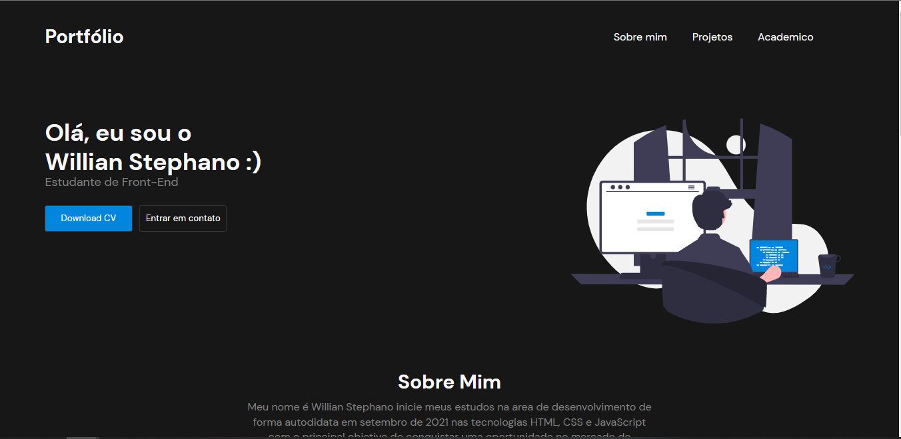

<h1 align="center">
   Portfólio 
</h1>

<h4 align="center">
  Projeto criado com o intuito de aprimorar meus conhecimentos nas tecnologias HTML, CSS alem de mostrar os principais projetos desenvolvidos.
</h4>

## 📚 Seções
O projeto é composto por uma pagina que contem 4 seções principais:

- **Intro:** Apresentação e acesso ao meu curriculo;
- **Sobre mim:** Uma breve descrição pessoal em seguida de todas minhas redes sociais;
- **Projetos:** Acesso aos principais projetos desenvolvidos;
- **Historico academico:** Contem principais cursos realizados, em andamento assim como acesso a todos meus certificados;

---

## 💼 Tecnologias utilizadas
Para o desenvolvimento deste projeto utilizei as seguintes tecnologias:

- HTML;
- CSS;
- JS;
---

#### Autor
Willian Stephano
